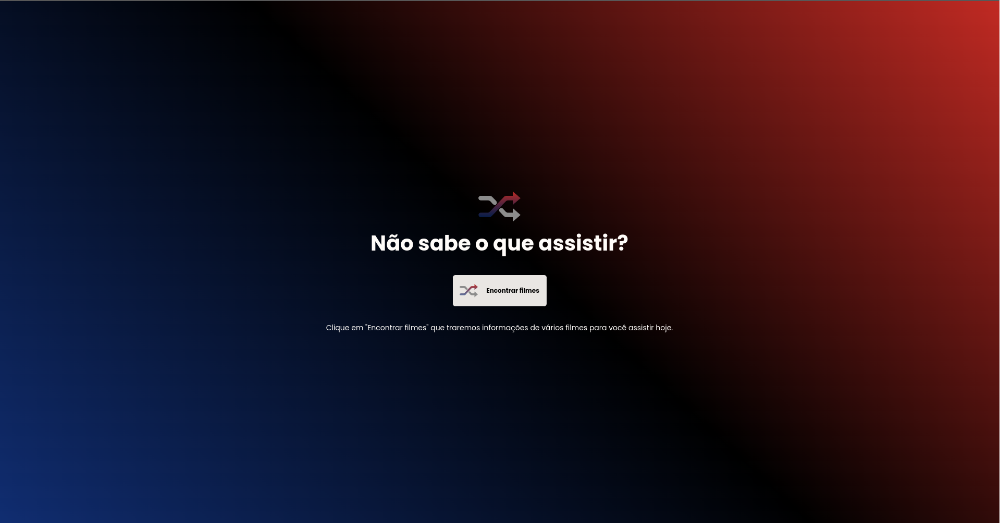

<h1 align="center"> Um catálogo de filmes</h1>

<p align="center">
  
</p>


## :rocket: Tecnologias

- React
- Hooks
- React Router Dom
- CSS Modules
- TypeScript
- Figma

## :computer: Instalação

Certifique-se de ter o npm e o node.js instalados em sua máquina antes de seguir os passos acima.

```bash
  # Clone o repositório
  $ git clone https://github.com/pedroygor/flix.git

  # Entre na pasta do projeto
  $ cd flix

  # Instale as dependências:
  $ npm install

  # Execute o projeto
  $ npm run dev
```

Agora você pode acessar o projeto em <http://localhost:5173>

## :key: Variáveis de Ambiente

Para rodar esse projeto, você vai precisar adicionar as seguintes variáveis de ambiente no seu .env

`API_KEY` da API [https://api.themoviedb.org/](https://api.themoviedb.org/)

## :movie_camera: Demonstração

[Pequena demonstração](https://youtu.be/RrQ7nZjPKfo)
